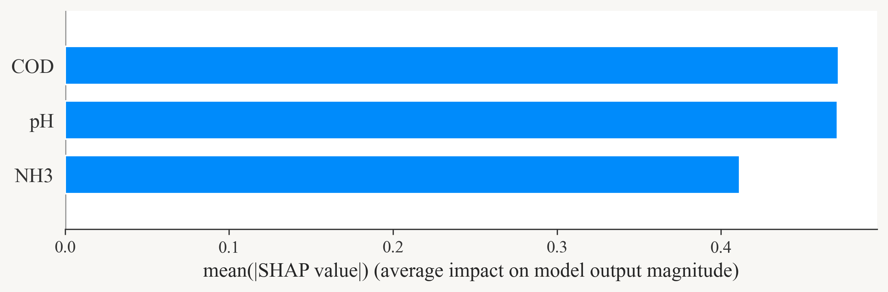
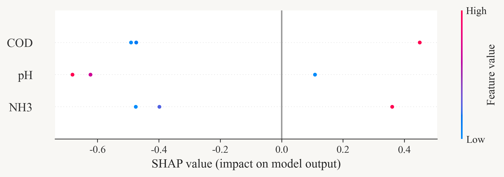
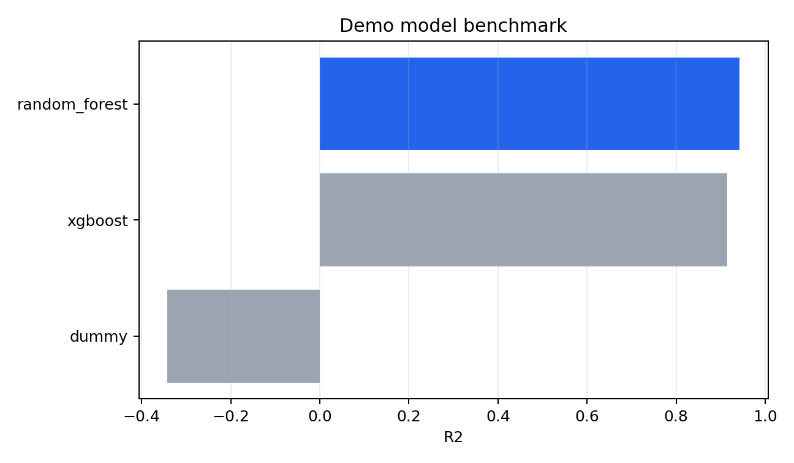
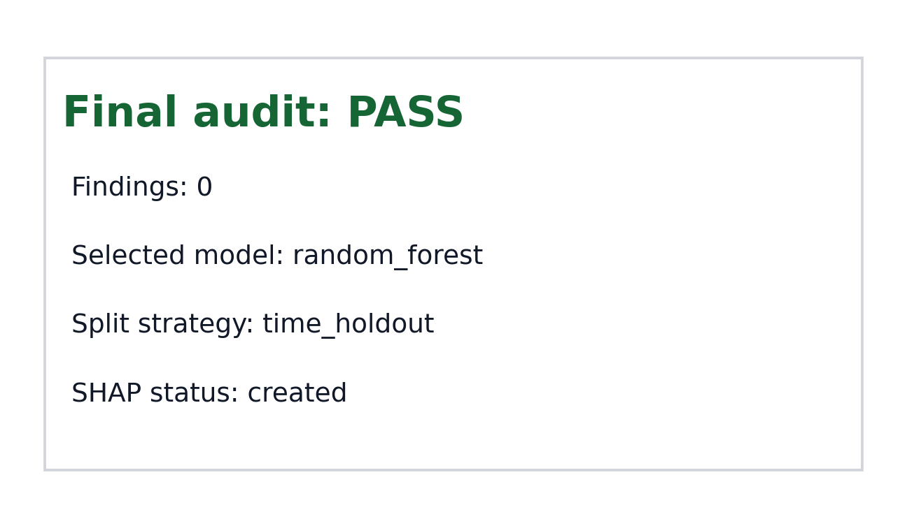

# ML-SHAP Skill

ML-SHAP is a Codex- and Claude Code-compatible skill for reproducible SHAP-based machine-learning workflows on structured tabular data. It is designed for environmental, water-quality, carbon-emission, risk, materials, and other research-style datasets where leakage control, validation design, evidence tracking, and report auditability matter.

Status: beta. The skill can bootstrap and run a conservative baseline workflow, but expert review is still required for study design, feature availability, literature evidence, and final scientific claims.

## What It Does

- Profiles tabular datasets and drafts a dataset datasheet.
- Reviews feature decisions for leakage, identifier predictors, time/group/spatial roles, and high-correlation interpretation risks.
- Runs a leakage-aware baseline modeling pass with train-only preprocessing.
- Selects time, group/spatial, stratified, or random holdout according to detected data structure.
- Benchmarks dummy, Random Forest, and XGBoost models when dependencies are available.
- Generates core SHAP artifacts, global importance tables, and paired SVG/PNG charts.
- Imports literature evidence notes into `evidence_bank.json` and citation support tables.
- Assembles a concise `report.md` and `model_card.md`.
- Validates required artifacts and cross-file consistency with a phase-aware audit script.

## Demo Gallery

These images are generated from the synthetic example workflow in `examples/`.

### SHAP Global Importance



### SHAP Beeswarm



### Model Benchmark



### Final Audit



## Repository Layout

```text
ml-shap/
  SKILL.md                 # Codex skill entrypoint and workflow contract
  agents/openai.yaml        # UI metadata for Codex skill lists
  docs/images/              # README demo figures
  scripts/                  # Executable workflow helpers
  references/               # Detailed method, SHAP, reporting, and domain guidance
  assets/                   # Report template assets and visual reference gallery
  examples/                 # Small reproducible demo inputs
```

## Installation

Clone or copy this folder into your agent skill directory.

For Codex:

```bash
git clone <repo-url> ~/.codex/skills/ml-shap
```

For Claude Code:

```bash
git clone <repo-url> ~/.claude/skills/ml-shap
```

On Windows, the equivalent user-level locations are usually:

```powershell
git clone <repo-url> "$env:USERPROFILE\.codex\skills\ml-shap"
git clone <repo-url> "$env:USERPROFILE\.claude\skills\ml-shap"
```

Install Python dependencies in your preferred environment:

```bash
pip install -r requirements.txt
```

On Windows, use UTF-8 mode when running the scripts if your data, paths, or reports contain non-ASCII text:

```powershell
$env:PYTHONUTF8 = "1"
```

## Quick Demo

Run the example workflow from the repository root:

```bash
python scripts/bootstrap_run.py examples/water_quality_sample.csv --run-dir runs/demo --target target --tier standard --user-text "water quality regression with temporal site groups"
python scripts/review_features.py --run-dir runs/demo --target target --apply-safe-defaults
python scripts/run_modeling.py examples/water_quality_sample.csv --run-dir runs/demo --target target --split-strategy auto
python scripts/update_evidence_bank.py --run-dir runs/demo --source examples/evidence_sample.csv
python scripts/assemble_report.py --run-dir runs/demo --title "Demo ML-SHAP Report"
python scripts/validate_outputs.py runs/demo --phase final
```

Expected final audit result:

```json
{
  "status": "pass",
  "finding_count": 0
}
```

## Skill Usage

In Codex, invoke the skill with `$ml-shap` or by asking for an ML-SHAP, SHAP, XGBoost-SHAP, explainable AI, or structured-tabular XAI workflow.

In Claude Code, invoke the skill with `/ml-shap` if slash-skill invocation is available, or ask Claude Code to use the skill installed at `~/.claude/skills/ml-shap`.

Both agents should read `SKILL.md` first, then load only the relevant references and scripts for the task. The workflow does not depend on Codex-only tools; `agents/openai.yaml` is optional UI metadata for Codex and can be ignored by Claude Code.

## Visual Reference Gallery

The folder `assets/reference-gallery/` is reserved for local, user-provided visual references for XGBoost, SHAP, interaction, heatmap, and PDP outputs. To keep the public repository copyright-safe, no third-party reference images are bundled.

If you want to use visual references, place only images that you created yourself, generated from your own analysis, licensed for redistribution, or have explicit permission to use. Treat them as style guidance only; generated analysis should still follow the scientific and audit rules in `SKILL.md`.

Recommended tiers:

- `quick`: triage, core modeling, and basic SHAP notes.
- `standard`: reproducible analysis with profiling, feature decisions, benchmark, SHAP, manifest, and audit.
- `research`: report-grade workflow with evidence bank, model card, uncertainty/stability checks when relevant, and final audit.

## Scientific Caveats

- SHAP values explain a fitted model; they do not establish causal effects by themselves.
- Time, spatial, group, ID, and post-outcome variables require domain review before being used as predictors.
- Literature evidence imported from CSV/JSON is a support bank, not an automatic citation guarantee. Verify all papers, claims, and citation metadata before publication.
- High-stakes prediction tasks require additional domain review, calibration, bias/applicability checks, and external validation where possible.

## Development Checks

Compile scripts:

```bash
python -m compileall -q scripts
```

Validate the skill folder when the system `skill-creator` tooling is available:

```bash
python <path-to-skill-creator>/scripts/quick_validate.py .
```

## License

MIT. See `LICENSE`.
